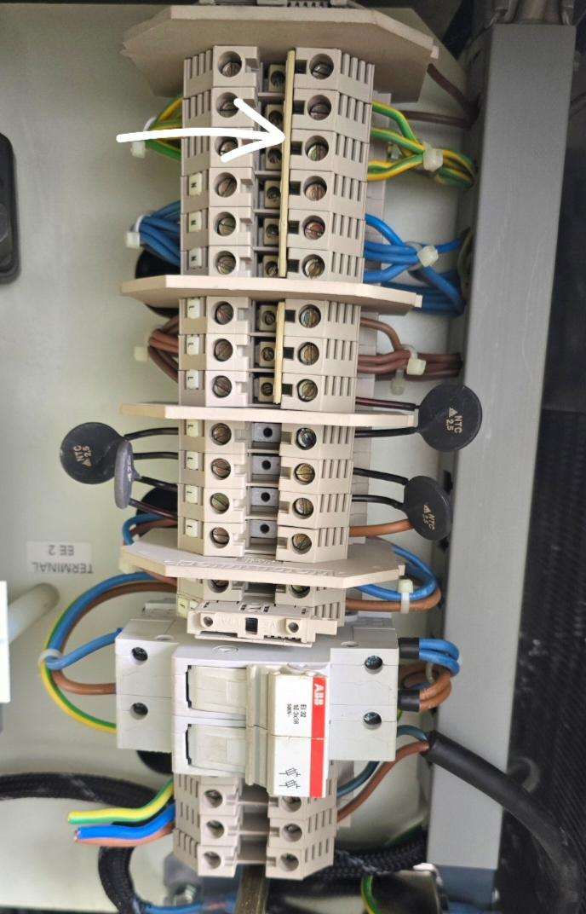
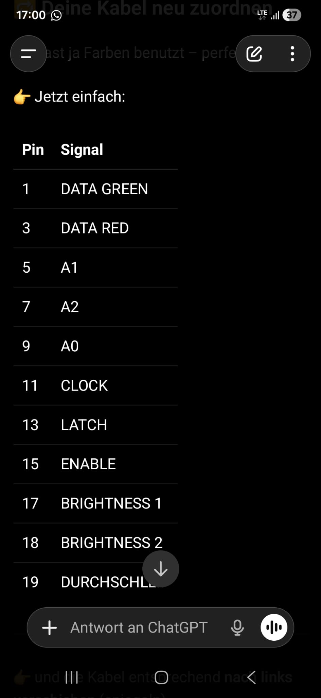
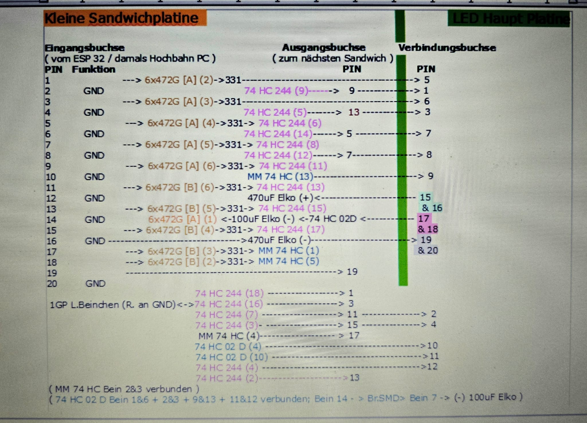
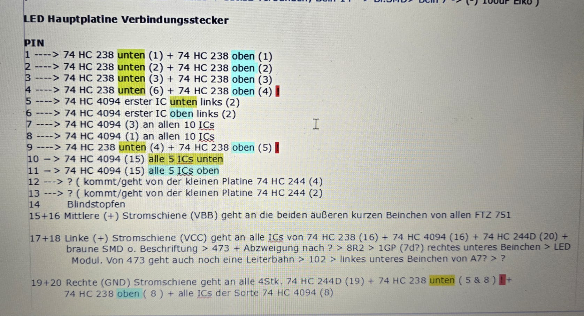

# Dokumentation Zugzielanzeige (ZZA)

---
## Todo
- Korrekte Pin Belegung der Flachbandkabel bestimmen
- code mit höherer Aktualisierungsrate schreiben (leds mit 60-100Hz ansteuern -> digitalWriteFast(), keine/nur kurze delays)
- Gehäuse schön machen

---
## Aufbau ZZA
200x64 Pixel, jeweils die Farben Rot und Grün seperat ansteuerbar.

Je 200x16 Pixel pro Flachbandkabel -> insgesammt 4 Flachbandkabel pro seite. (Pin belegung s. Kap. LED Matrix Ansteuerung)

Insgesamt 7 Netzteile, 3,5 für jede Seite

---
### LED Matrix Ansteuerung

#### Pin belegungen:
## Stecker (2x10 pins)

Oben: links Pin 1, rechts Pin 2 — Reihen fortlaufend nach unten

|Pin|Belegung|Pin|Belegung|
|---:|---|---:|---|
|01|Data_G|02|GND|
|03|Data_R|04|GND|
|05|CLK|06|GND|
|07|STR|08|GND|
|09|A0|10|GND|
|11|A1|12|GND|
|13|A2|14|GND|
|15|Chip Select|16|GND|
|17|Enable Red|18|Enable Green|
|19|NC|20|GND|

- Data_G:   Datenleitung für grüne LEDs
- Data_R:   Datenleitung für rote LEDs
- CLK:      Clock Leitung, global für alle Sections
- STR:      Strobe/Latch, global für alle Sections
- A0:       Bit1 der 3-Bit Zeilenauswahl
- A1:       Bit 1 der 3-Bit Zeilenauswahl
- A2:       Bit 2 der 3-Bit Zeilenauswahl
- CS:       Hardwareseitiges Umstellen zwischen oberen und unteren 8 bit

- EN_R:     Output Enable für rote LEDS, active LOW
- EN_G:     Output Enable für grüne LEDS, active LOW

- Pin 19: Wahrscheinlich unused, auf jeden Fall nicht GND

#### Probleme / Fixes
|Problem      |Potentieller Fix|
|-------------|----------------|
| LEDs bleiben nicht an, blinken nur kurz | schneller ansteuern, zeile leuchtet nur wenn angesteuert |
| Pin belegung stimmt nicht | kabel nachverfolgen, test codes |
  
---
## Protokoll ZZA (Anwesenheit:[Finn,Jan,Jonas,Mikko,Erik])
### 12.05.2026 
(Treffen bei Finn) [X,X, ,X,X]
- Entfernen unnötiger Kabel (2x RS485; 1x Steckdose mit Zuleitung; ursprüngliche Datenleitung)
- Auftrennen der Brücke zwischen N und Erde
- Entfernung von Schmelzsicherung (4A) und Kontaktklemmen auf linker Hutschiene
- Erdungseingang mit einer 2er Brücke um eine Kontaktklemme erweitert

### 16.05.2026 [X, , , , ]
- erfolgreiches ansteuern der LEDs
    - ganze reihe/einzelne LEDS ohne flackern

### 31.05.2026 (Online) [X,X,X,X,X]
- Besprechung von Projektplanung

### 07.06.2026 (Online) [X,X, , ,X]
- Nachbereitung der Projektplanung mit Verbesserungsvorschlägen
    - genauere Ziele (sollen quantitavtiv messbar sein)
    - verantwortliche für Risiken
    - Projektleiter/Kommunikation von Finn auf Erik übertragen
    - Meilensteine/mehr parallelität im Zeitplan

---
## Infos vom Typ mit dem anderen ZZA (Andy)
> Die Infos von einem Techniker der Hochbahn waren:
> -Herkunft U1 Stephansplatz / Meßberg
> - Steuerrechner wegen Datenschutz ausgebaut. Hat die Daten über Profibus bekommen. Im Gehöuse hängen nur noch die 7 Flachbandkabel. Die LED Matrix beruht auf einer Schieberegistersteuerung.

> Falls Ihr die Tafel in einer Wohnung anschließen wollt, müsst Ihr vorher diese Brücke zwischen Null und Erde entfernen, sonst gibt es eine böse Überraschung 😉 Die Hochbahn nutzt eine "Nullung" ohne FI
> 
> 

> Es sind 7 Netzteile verbaut mit 50 Ampere zu 5 Volt, wobei 3 + 1/2 sich je eine Tafelseite teilen. 
> Die gelb verdrillten Adern sind als "Current Share" mit den anderen NT verbunden um die Last aufzuteilen

> Die grauen Kabel welche ehemals auch am Steuerrechner hingen sind Hauptsächlich Temperatursensoren und 2 Fotowiederstände ( Helligkeitssteuerung ) Wird also nicht benötigt

> Je 4 Flachbandkabel gehen zu jeder Tafel. Es  sind 4 Reihen LED Matrix Module welche zusammen 64x200 Pixel ergeben

> Die Netzteile ACE-935 A sind Industrienetzteile, haben oben aber trotzdem normale Kaltgerätestecker, welche auf der Reihenklemme angeschlossen sind. 
> Du kannst die Stecker von den Netzteilen abziehen und somit nur eine Seite versorgen. Wobei das 4te Netzteil für beide Seiten auf der Seite welche "aus" bleiben soll abgeklemmt werden sollte.

> Wichtig! Nicht nur die Brücke entfernen. Prüft auf jeden Fall die Erde. Bei mir hat ein Kabel gefehlt, das ist im Fehlerfall nicht ohne

> Die Verteilung:
> 220V -> Untere Reihenklemme ( hier fehlte bei mir eine Brücke zur Erdung ! )
> -> Entstörfilter -> 2x Keramiksicherung -> 4x NTC-Thermistor in Reihenklemme -> L1 Reihenklemme -> 8x Kabel zu den "Verbrauchern" und einer Servicesteckdose ohne Schutzkontakt

> Ich habe die Platine Reverse zu dem Wannenstecker zurückgemessen.
> Anhand der Datenblätter der vorhandenen Bauteile könnte das hier die Belegung sein ( zu etwa 70% ) Leider bisher kein Lebenszeichen der LED's. Ich Experimentiere allerdings mit einem ESP32 Dev 4, der sendet nur 3,3V. TTL aus den 90s ist aber 5V, entsprechend Löte ich gerade ein paar 74 HCT 245 ( Level Shifter ) auf eine Lochrasterplatine inkl. Glättungs Kondensatoren. Denn auf der Sandwichplatine ist ein Wiederstandsnetzwerk und 330 Ohm SMD Wiederstände. Möglicherweise wird das Signal dort so weit abgeschwächt das nichts mehr passiert
>
> 

> Wichtig ⚠️ Auf den LED Platinen sind 3 Schienen. 
> GND ( Rechts ) / +5V  ( Mitte ) für die LED Matrix Versorgung  ( gehen an alle FTZ 751 ) -> VBB beschriftet /  +5 Volt ( Links ) VCC > kommt von einem einzigen Netzteil und versorgt beide Tafelseiten mit Spannung für die Logik + die Lüfter der Klimaanlage. Wenn die Lüfter laufen,  bekommen die Boards auch die Logikspannung. Merkt man sofort, weil die Tafel dann sehr laut wird

> Für meine Tests habe ich +5V über ein 1K Ohm Wiederstand direkt auf Pin 17 o. 18 gegeben, welcher eventuell später   Multiplex die Lichtstärke steuert. Hat aber leider nichts gebracht. Wenn mit meinen Level Shift nichts geht, würde ich mir noch mal Clock und Strobebanschauen.
>
> 
>
> 
>
> Bedeutung: Links der Eingangsstecker ( der Wichtige ) auf der kleinen Platine + Ausgangsstecker, welcher die Signale weiter zum nächsten LED Modul ( über Bufferausgang  74HC244 ) weiterreicht. Der Verdindungsstecker leitet die Dignale an die Hauptplatine zu den Schieberegistetn, Buffern und Multiplexer 238
> P.S. Alles in Klammern z.B. (3) steht  für Beinchen 3 vom Bauteil. Mit den Datenblatt konnte ich so versuchen den Sinn dahinter zu verstehen.

> Guten Morgen, 
> das Wichtigste für Euch:
> Es gibt nun eine 99% Verifizierung der Pin  Belegung. Mein Kumpel und ich haben nach 4 Augen Prinzip meine Messung reverse zurück verfolgt.
>
> Das hier ist das finale Ergebnis:
>
> - Pin 01: Data Green
> - Pin 03: Data Red
> - Pin 05: Clock (Schieberegister Takt)
> - Pin 07: Latch(Speicher-Übernahme/Strobe)
> - Pin 09: Adresse A0 (Zeilenwahl Bit 0)
> - Pin 11: Adresse A1 (Zeilenwahl Bit 1)
> - Pin 13: Adresse A2 (Zeilenwahl Bit 2)
> - Pin 15: Chip-Select (Weiche 8/16 Zeilen)
> - Pin 17: Enable / Brightness 1
> - Pin 18: Enable / Brightness 2
​> - Pin 02, 04, 06, 08, 10, 12, 14, 16, 20: Masse (GND)
> - Pin 19: Unbelegt / Durchschliff

> Wie sind wir darauf gekommen:
​> Data (Pins 1 & 3): Füttern die jeweils 5x 74HC4094 Schieberegister (Pin 2)
​> Clock (Pin 5): Taktet alle 74HC4094 (Pin 3)
​> Latch (Pin 7): Schaltet die Daten der 74HC4094 auf die Ausgänge (Pin 1)
​> Adressen (Pins 9, 11, 13): Wählen die Zeile über die 74HC238 Decoder (Pins 1, 2, 3)
​> Weiche (Pin 15): Schaltet hardwareseitig zwischen dem oberen (Enable Low) und unteren (Enable High) 74HC238 Decoder um.
​> Brightness (Pins 17 & 18): Steuern über Gatter-Logik den Output-Enable (Pin 15) der 74HC4094 Schieberegister für Blanking oder PWM-Dimmung

> Multiplexing-Zwang: Da die Zeilen über die 238er Decoder (Adress-Pins 9, 11, 13) gewählt werden, leuchtet eine Zeile nur so lange, wie sie aktiv adressiert wird. In einer Matrix-Ansteuerung muss man permanent im Kreis alle Zeilen (0-15) immer wieder extrem schnell hintereinander ansteuern (ca. 60-100 mal pro Sekunde).
​> Die Lösung: Die Software darf nicht "warten". Sie muss in einer schnellen Endlosschleife Daten schieben -> Latch drücken -> Zeile wechseln -> Wiederholen.

> Das deckt sich mit der Vermutung meines Kumpels. Habe vorhin mit Ihm telefoniert. 
> digitalWrite hat einen enormen Overhead. Bei später 12.800 LEDs (64x200) und 16 Zeilen Multiplexing-Zwang summiert sich diese Verzögerung so stark auf, dass die Refresh-Rate in den Keller geht und die Schutzschaltung der Solari-Platine (vermutlich über die 74HC02/244 Logik) wegen fehlender Takt-Dynamik dichtmacht.
> 
> ​digitalWriteFast ist für den Arduino Mega schon ein riesiger Sprung (Faktor 10-20), da es die Pin-Prüfung zur Kompilierzeit erledigt. 80Hz Refresh-Rate wären super.
> 
> ​Deshalb hat mir mein Kumpel zum ESP32 geraten. Der taktet nicht nur mit 240MHz (statt der 16MHz vom Mega), sondern kann über DMA (Direct Memory Access) die Daten fast ohne CPU-Last an die Schieberegister rauspumpen
>
> ​Haltet mich auf dem Laufenden, ob die 1-2MHz mit digitalWriteFast ausreichen, um das Bild stabil zu halten oder ob das Timing zwischen Clock & Latch angepasst werden muss. Viel Erfolg ✌️🍀