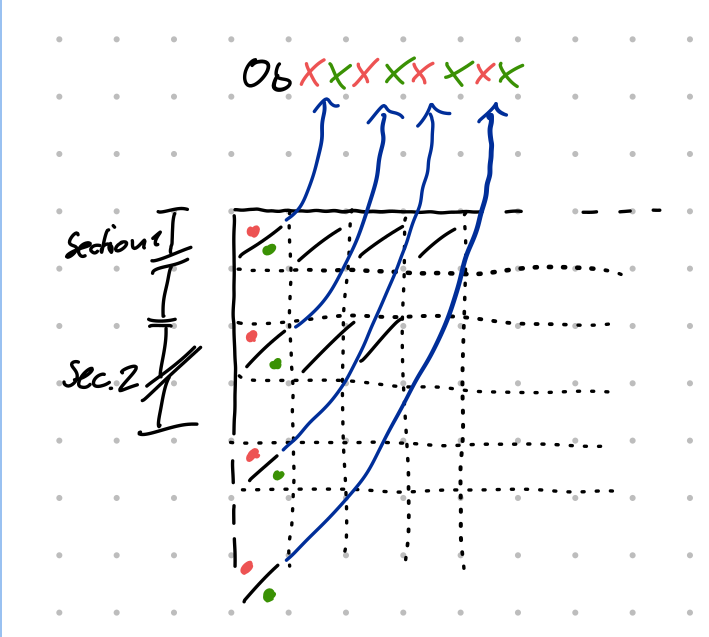

### beschreibung funktionsweise vom code
eine 200x64 Pixel Matrix wird beschrieben durch eine 200x16 Bitmap Matrix.
Die Pixel Matrix hat pro Pixel die farben rot und grün.
Die zusammenhang zwischen bitmap und Pixel matrix ist folgendermaßen:\
bitmap[x][y] bit 7 -> pixelMatrix[x][y] rot\
bitmap[x][y] bit 6 -> pixelMatrix[x][y] grün\
bitmap[x][y] bit 5 -> pixelMatrix[x][y+16] rot\
bitmap[x][y] bit 4 -> pixelMatrix[x][y+16] grün\
bitmap[x][y] bit 3 -> pixelMatrix[x][y+32] rot\
bitmap[x][y] bit 2 -> pixelMatrix[x][y+32] grün\
bitmap[x][y] bit 1 -> pixelMatrix[x][y+48] rot\
bitmap[x][y] bit 0 -> pixelMatrix[x][y+48] grün

Dieser aufbau dient dem schnelleren schreiben, da man dann im code alle pins von Port A auf einmal setzen kann und somit theoretisch nur ~1/8 der zeit benötigt um die gesamte Pixel Matrix zu beschreiben.

### Bild zum anzeigen generieren
Um mit ImageToBitmap ein bild für die Matrix zu generieren muss man ein Bild mit 200x64 pixeln haben, welches aus den rgb values (255,0,0), (255,255,0), (0,255,0) besteht. Das ganze wird in eine header datei geschrieben, welche dann im eigentlichen programm aufgerufen wird. 

Um RAM zu sparen wird das mit im Flash speicher statt im RAM gespeichert.